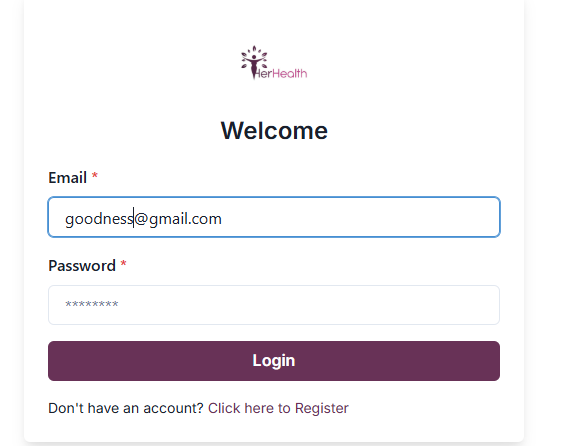
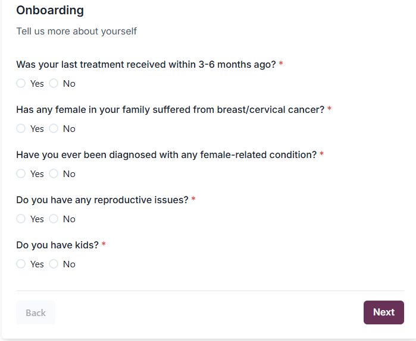
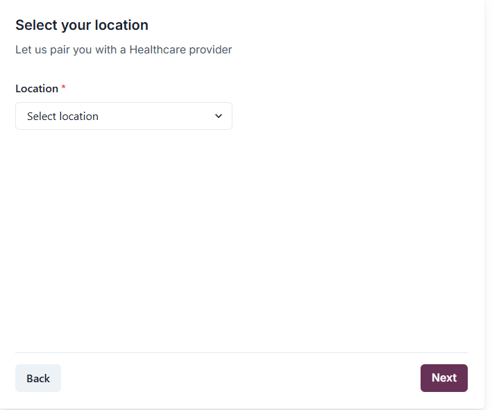
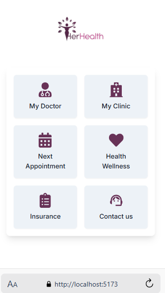

# Her Health Project
## Author: [Goodness Ihejiofor]

## Description:
This project (HER HEALTH) is designed to provide a comprehensive health management system for Women to monitor and manage Female related diseases. It aims to utilize technology to close the gender sap in healthcare for women in Nigerian communities through a Health Management applications that monitors, and consult for female-related diseases, reducing the incidence of preventable deaths.

## Features:
1. User Registration and Login
2. Disease Monitoring and Consultation
3. Health Tips and Advice
4. User Profile Management
5. Insurance and checkup scheduling
6. User Support and Feedback 

## 🔗 GitHub Repositories
- **Backend Repository**: (https://github.com/GoodnessIhejiofor/her-health-backend-repo)
- **Frontend Repository**:(https://herhealth.info/)
- **API Endpoints**: (https://api.herhealth.info/)

## Setting Up the Environment and the Project

### Install/must haves
- Visual studio code (for backend)
- Node.js
- React.js (for the frontend)
-Name cheap (SQL and email service provider)

### Backend 
1. Clone the backend repository:
   ```bash
   git clone https://github.com/GoodnessIhejiofor/her-health-backend-repo.git
   cd her-health
   ```

2. Install dependencies:

```bash
npm install
```

Create a .env file in the root directory for env variables

env
DB
PORT
DB_Test

Run database migrations:


```bash
npm run start
npm run migrate
npm run seed
```

### Frontend 
Clone the frontend repository:

```bash
git clone https://github.com/GoodnessIhejiofor/her-health.git
cd her-health
```

Install dependencies:


```bash
npm install
```
Create a .env file 

Start react development server:

```bash
npm run dev
```
Open the app in your browser at http://localhost:5173.

Designs
Screen shot of some app interfaces



<!--  -->



### Deployment Plan (https://herhealth.info/)

Deployment has been done after testing and continous integration is done.


<!-- # React + TypeScript + Vite

This template provides a minimal setup to get React working in Vite with HMR and some ESLint rules.

Currently, two official plugins are available:

- [@vitejs/plugin-react](https://github.com/vitejs/vite-plugin-react/blob/main/packages/plugin-react/README.md) uses [Babel](https://babeljs.io/) for Fast Refresh
- [@vitejs/plugin-react-swc](https://github.com/vitejs/vite-plugin-react-swc) uses [SWC](https://swc.rs/) for Fast Refresh

## Expanding the ESLint configuration

If you are developing a production application, we recommend updating the configuration to enable type aware lint rules:

- Configure the top-level `parserOptions` property like this:

```js
export default tseslint.config({
  languageOptions: {
    // other options...
    parserOptions: {
      project: ['./tsconfig.node.json', './tsconfig.app.json'],
      tsconfigRootDir: import.meta.dirname,
    },
  },
})
```

- Replace `tseslint.configs.recommended` to `tseslint.configs.recommendedTypeChecked` or `tseslint.configs.strictTypeChecked`
- Optionally add `...tseslint.configs.stylisticTypeChecked`
- Install [eslint-plugin-react](https://github.com/jsx-eslint/eslint-plugin-react) and update the config:

```js
// eslint.config.js
import react from 'eslint-plugin-react'

export default tseslint.config({
  // Set the react version
  settings: { react: { version: '18.3' } },
  plugins: {
    // Add the react plugin
    react,
  },
  rules: {
    // other rules...
    // Enable its recommended rules
    ...react.configs.recommended.rules,
    ...react.configs['jsx-runtime'].rules,
  },
})
``` -->
